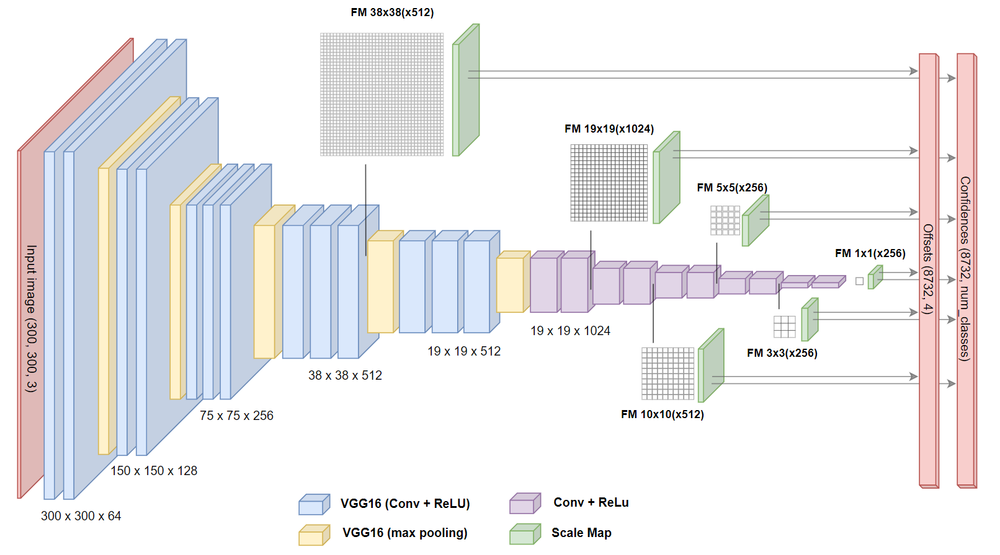
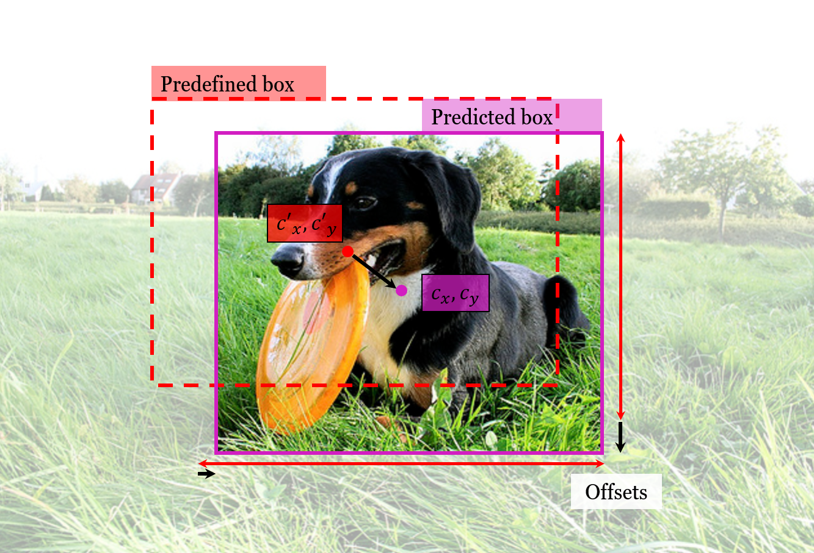
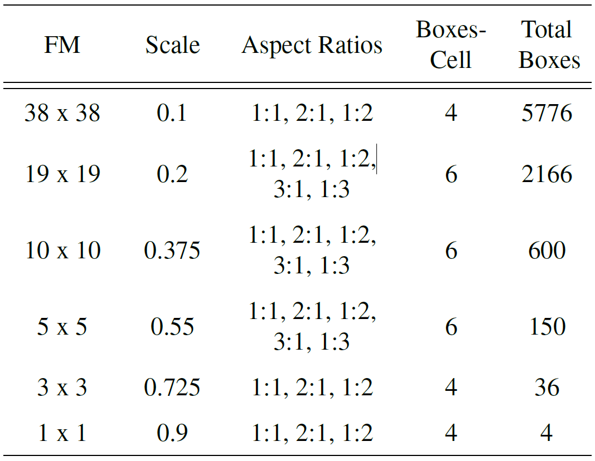
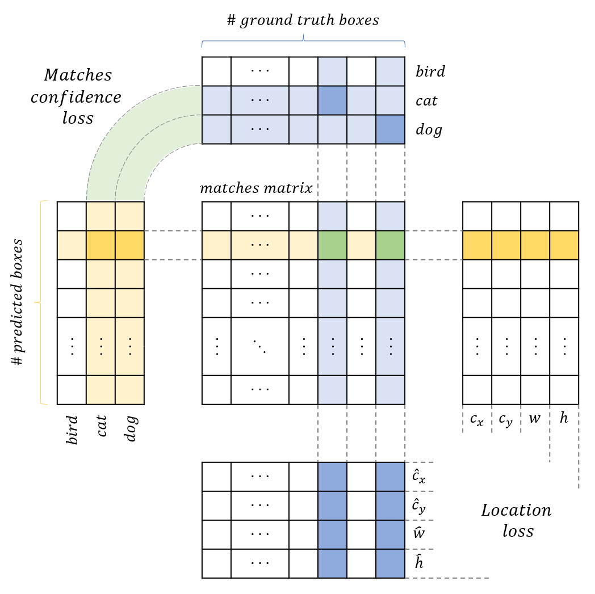

# PyTorch Implementation of Single Shot MultiBox Detection

This repository contains the code for building and training the [SSD model](https://arxiv.org/abs/1512.02325) using PyTorch. The model is trained on the Microsoft COCO Dataset and can be used for object detection in images.

**Requirements**: <tt>PyTorch 1.13.0+cu117</tt>

## Model and Implementation Details

### The Network Architecture

The network consists on a pre-trained base architecture (VGG16), followed by several convolutional layers in order to get different sizes for the feature maps and hence, for bounding boxes. For every feature map, we perform two different convolutions with a 3x3 kernel: one to obtain the offsets that will give us the coordinates of the box, and another one to obtain the confidences for the different categories of the box. At the end of the architecture, we stack all the offsets and confidences of the different feature maps to obtain the final output.

### Offsets and Predefined Default Boxes

Predefined default boxes are a key aspect of the SSD architecture. These boxes are fixed prior to the training of the model, and they are used as a reference for predicting the location and size of the objects in the images. The model learns the offset values between the default boxes and the target bounding boxes.

Throughout the model we use the coordinates $(c_x, c_y, w, h)$ to define our boxes; where $(c_x, c_y)$ denote the center of the box, and $w$ and $h$ are the width and height, respectively. The offset values ($g$) are computed as the relative difference between the coordinates of the default boxes ($d$) and those of the prediction ($p$).

  

$$
g^{c_x} = \frac{p^{c_x}-d^{c_x}}{d^w}, 
\quad g^{c_y} = \frac{p^{c_y}-d^{c_y}}{d^h},
\quad g^w = \log\frac{p^w}{d^w},
\quad g^h = \log\frac{p^h}{d^h}.
$$

The default Box Specifications for each Feature Map are as follows:

  

The table shows the aspect ratios, number of boxes, and other specifications for the default boxes used in each feature map of the SSD model. Note that an extra box is defined for each position using the scale $S_k = \sqrt{s_ks_{k+1}}$ and a ratio of 1. The default boxes sizes are defined as $w = s\sqrt{a}$, $h = s/\sqrt{a}$; and they are centered in the center of the cell they are being defined in.

### Objective function

The training objective of the SSD model is to predict, not only the location of objects (i.e. the coordinates of the bounding boxes), but also what the object is (i.e. its class). To achieve this goal, we need a multi-task loss function that will be able to train the model to generate bounding boxes around objects and to classify them in different categories.

Our starting point are 8732 predefined boxes, hence we need to make sure the model learns which of the boxes are valuable for each image. We do this by determining which of the default boxes correspond to a ground truth detection and introduce this knowledge into the loss. In order to do this, we develop a matching strategy. and we refer to all of the predictions that correspond to at least one target box as _matches_.

The general loss function for the matches measures the difference between the predicted bounding boxes and the ground-truth bounding boxes. For the localization task, we used the Smooth L1 loss to train the SSD, which combines the L1 and L2 losses through a threshold. By using this loss function, the model is able to learn the variations in the position and size of the objects in the image, and adjust the predicted bounding boxes accordingly. For the classification task, we used the softmax loss. On the contrary, to learn that where no match occurs, there are no objects (i.e. the confidences should be null for all classes); we use the softmax loss with the opposite objective. We do not talk about localization loss for not matching boxes, since the purpose is to reduce their confidence so they will not appear in the predictions.

$$
    L = L_{\text{loc}} + L_{\text{conf}} + L_{\text{no match}}
$$

.

$$
\begin{array}{lll}
      L_{\text{loc}} & = & \text{Smooth L1}((p^{c_x}, p^{c_y}, p^{w}, p^{h}), (d^{c_x}, d^{c_y}, d^{w}, d^{h}))\\
      L_{\text{conf}} & = & - \sum_{i\ \in\text{matches}} \log\frac{c_{match}}{\sum_{j} c_j}\\
      L_{\text{no match}} & = & \sum_{i\ \not\in\text{matches}} \log\biggl(1 + \frac{c_{max}}{\sum_{j} c_j}\biggr)
\end{array}
$$

#### Matching Strategy
The matching strategy is a crucial component of the object detection process. It determines which of the default boxes are comparable to a target bounding box and, as a result, its offsets should be learnt. For this specific purpose, the SSD model uses the Jaccard similarity, which measures the overlap between the two boxes proportionally to their sizes. More precisely, the pairs of boxes that have a Jaccard similarity greater than 0.5 are considered a match. By using this criterion, a default box could be matched with more than one ground truth and vice versa.

#### Hard Negative Mining
The number of no matching boxes will be most likely higher than that of the matches. For this reason, we do not use all of the boxes when calculating the loss, but only those that have the highest contribution to it. Hard negative mining is a technique used to improve the performance of object detection models by selectively choosing the most difficult negative samples during training. In this project, we utilized a mining ratio of 3:1, meaning that we selected three negative samples for each positive one. The negative samples were chosen by selecting the highest confidence for every no-matched box, then comparing the confidence of these predictions with respect to other boxes. This approach allows the model to focus on the most challenging negative samples, improving the ability to distinguish between objects and non-objects.

#### Implementation
To ensure an efficient and effective training of the SSD model, a correct implementation of the loss is very important. The optimization of the process is challenging for the need to combine two tasks: many-to-many matching and class index extraction. The solution we chose to efficiently match predicted boxes and their corresponding ground truths for computing $L_{\text{loc}} \text{ and } L_{\text{conf}}$ can be seen in the following image. And it avoids nested for loops by using PyTorch indexing operations.

  

### Prediction Strategy

The model has a large number of outputs, i.e., many bounding boxes and their respective class confidences per pixel of the input image's representations at different scales. An efficient way of actually extracting the inferred object detection is non-maximum suppression (NMS) of the predictions.

This procedure is as follows: for every class, we sort the predicted boxes by their confidence in descending order. Any box with confidence lower than 0.01 gets immediately rejected. The rest are compared with better predictions, and if they have a Jaccard overlap higher than 0.45, they get rejected as well. Finally, we only keep the top 200 remaining predictions.
